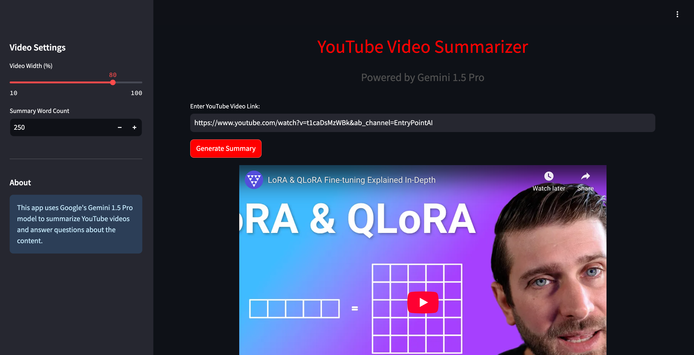
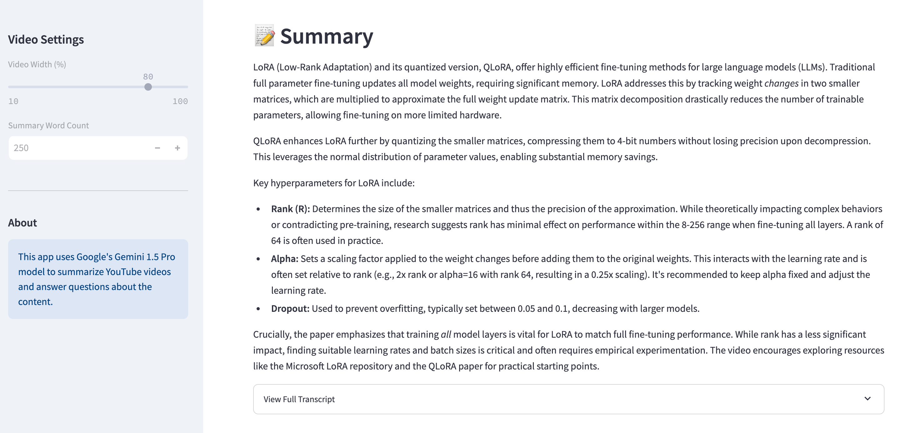
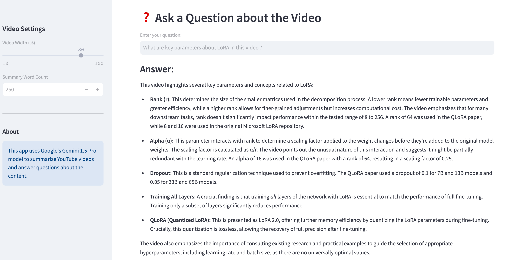

# **YOUTUBE VIDEO SUMMARIZER AND Q&A**

This Streamlit app allows users to summarize YouTube video transcripts and ask follow-up questions based on the transcript content. With an adjustable video thumbnail size, users can watch the video, review the summary, and get answers to specific questions about the video content.

# *Features*

YouTube Video Transcript Extraction: 
Automatically extracts the transcript from a given YouTube video. 

Summarization: Generates a concise summary of the transcript using Google Gemini Pro's language model. 

Interactive Q&A: Allows users to ask questions related to the video content, with answers generated from the transcript. 

Adjustable Video Thumbnail: Displays the YouTube video with an adjustable width for easy viewing within the app. 

Live on Streamlit: https://ytsummar.streamlit.app/
